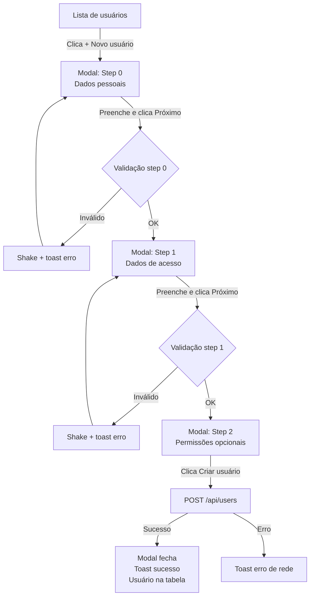
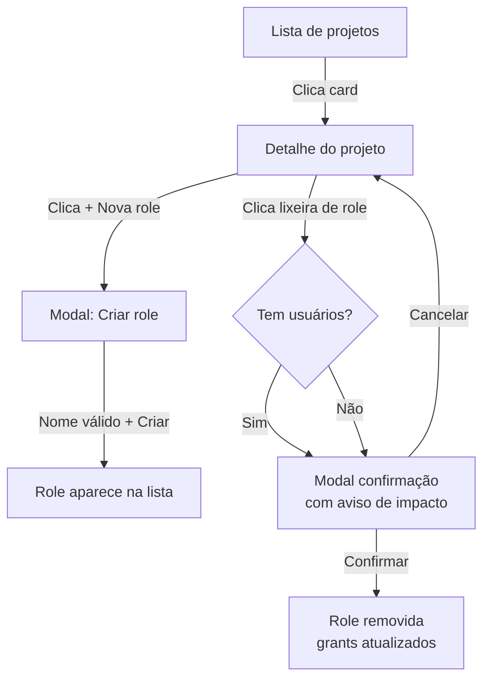
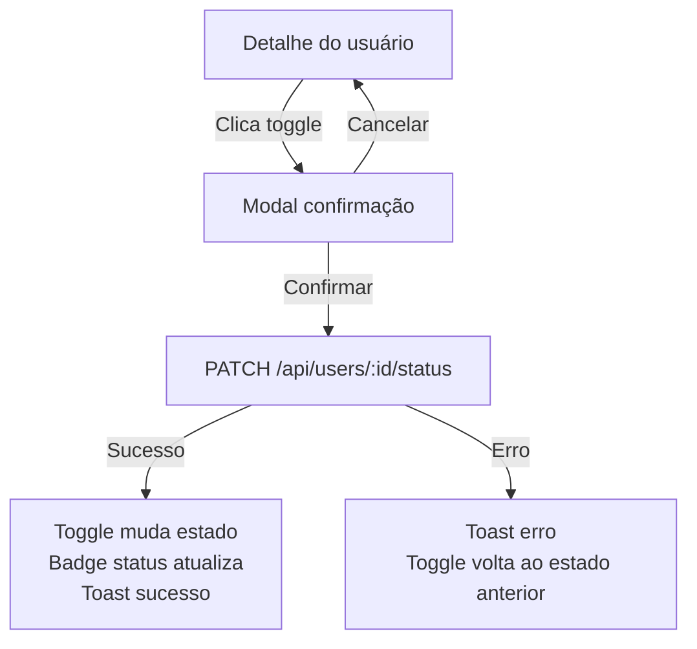

# Conecta Raros — Admin Panel
## Especificação de Wireframe & UX

> **Versão:** 2.0
> **Formato:** Documento de design substituto ao Figma
> **Público:** Desenvolvedor frontend implementando do zero
> **Stack alvo:** HTML + Tailwind CSS + TypeScript (Bun)

---

## 0. MODELO MENTAL DO SISTEMA

Antes de qualquer tela, entenda a hierarquia de dados:

```
PROJETOS  (fixos, definidos no Zitadel — o admin NÃO cria)
  └── ROLES  (criadas pelo admin e associadas a projetos)

USUÁRIOS
  └── GRANTS  (combinação usuário + projeto + lista de roles)
```

**Regras de negócio que afetam o design:**
- Um usuário pode ter grants em múltiplos projetos simultaneamente
- Um grant sempre tem: 1 projeto + N roles daquele projeto
- Excluir uma role deve alertar quantos usuários serão afetados
- O admin NÃO cria projetos — eles são provisionados no Zitadel

---

## 1. ESTRUTURA GERAL DO APP

### 1.1 Layout Shell (presente em todas as telas)

```
┌─────────────────────────────────────────────────────────────┐
│  NAVBAR  (altura fixa: 60px)                                │
│  [Logo + badge "admin"]          [Nome ADM + avatar]        │
├──────────────┬──────────────────────────────────────────────┤
│              │                                              │
│   SIDEBAR    │   ÁREA DE CONTEÚDO PRINCIPAL                 │
│   (220px)    │   (flex-1, overflow-y: auto)                 │
│   fixo       │                                              │
│              │                                              │
└──────────────┴──────────────────────────────────────────────┘
```

### 1.2 Navbar — detalhamento

**Esquerda:**
- Ícone do Conecta Raros (quadrado 28px, fundo `#172D48`)
- Texto "Conecta Raros" (Satoshi 700, 15px)
- Badge pill "admin" (fundo `rgba(38,29,17,0.08)`, texto 11px)

**Direita:**
- Nome do ADM logado (Satoshi 600, 13px)
- Cargo/role do ADM (Playfair italic 300, 12px, cor secundária)
- Avatar circular 36px com iniciais (fundo `#172D48`, texto `#F2E2C4`)

**Comportamento:** Navbar é sempre fixa no topo, não rola com o conteúdo. Sem ações clicáveis por enquanto (perfil do ADM é read-only).

### 1.3 Sidebar — detalhamento

**Seção "Gestão":**
- `Usuários` → view de listagem de usuários
- `Projetos & Roles` → view de gestão de roles por projeto

**Seção "Sistema":**
- `Auditoria` → placeholder (em desenvolvimento)
- `Configurações` → placeholder (em desenvolvimento)

**Rodapé da sidebar:**
- Botão "Sair" em vermelho `#A6290D`

**Item de nav ativo:** fundo `rgba(38,29,17,0.09)`, texto 700.
**Item de nav inativo:** texto `rgba(38,29,17,0.55)`, sem fundo.
**Hover:** fundo `rgba(38,29,17,0.06)`, texto `#261D11`.

**Responsividade:** Em telas < 768px, sidebar colapsa em hamburger menu com drawer overlay.

---

## 2. SEÇÃO: USUÁRIOS

### 2.1 Tela: Listagem de Usuários

**URL/rota:** `/usuarios`
**Estado padrão ao entrar na seção.**

#### Layout

```
┌─────────────────────────────────────────────────┐
│  Usuários                    [+ Novo usuário]   │
│  6 usuários cadastrados · 4 ativos              │
├─────────────────────────────────────────────────┤
│  [stat: Total] [stat: Ativos] [stat: Inativos]  │
│  [stat: Pendentes]                              │
├─────────────────────────────────────────────────┤
│  [🔍 Buscar por nome, email ou username...] [X] │
│  N resultados                                   │
├─────────────────────────────────────────────────┤
│  TABELA DE USUÁRIOS                             │
│  Usuário | Username | Status | Email | Criado   │
│  -------- linha por usuário --------            │
├─────────────────────────────────────────────────┤
│  ← Anterior   [1]   Próximo →                   │
└─────────────────────────────────────────────────┘
```

#### Cards de stat (4 colunas, grid)
- Fundo `#FAF0E0`, border-radius 12px, padding 20px
- Label: Satoshi 700 uppercase 11px letra-spacing 2px, cor `rgba(38,29,17,0.4)`
- Número: Satoshi 700 30px, cor variante por tipo:
  - Total → `#261D11`
  - Ativos → `#4F8448`
  - Inativos → `#A6290D`
  - Pendentes → `rgba(38,29,17,0.5)`

#### Barra de busca
- Pill shape, borda `1.5px solid rgba(38,29,17,0.2)`, fundo `rgba(250,240,224,0.5)`
- Input: Playfair italic 300, 15px
- Ícone lupa à esquerda
- Botão ✕ aparece **somente quando há texto digitado** — limpa o campo e devolve foco
- Contagem de resultados à direita da barra ("N resultados"), some quando busca vazia
- Filtra em tempo real por: nome completo, email, username (case-insensitive)

#### Tabela
- Fundo `#FAF0E0`, border-radius 16px, overflow hidden
- Header: Satoshi 700 uppercase 11px, cor `rgba(38,29,17,0.45)`, borda inferior `1.5px`
- Colunas: **Usuário** (avatar + nome + email), **Username**, **Status** (badge), **Email**, **Criado em**, **Ação**
- Linha hover: fundo `rgba(38,29,17,0.025)`
- Click na linha inteira → navega para detalhe do usuário
- Coluna "Ação": botão pill "Ver" que também navega para detalhe

#### Badge de status
| Valor | Fundo | Texto |
|---|---|---|
| `ativo` | `rgba(79,132,72,0.12)` | `#4F8448` |
| `inativo` | `rgba(166,41,13,0.1)` | `#A6290D` |
| `pendente` | `rgba(38,29,17,0.08)` | `rgba(38,29,17,0.6)` |

#### Estado vazio (busca sem resultado)
```
[ícone neutro centralizado, opacidade 20%]
"Nenhum usuário encontrado"
[Playfair italic, 15px, cor secundária]
```

#### Paginação
- Cursor-based (não numérica real na v1)
- Botões "← Anterior" e "Próximo →" desabilitados quando não há página adjacente
- Página atual destacada com fundo `rgba(38,29,17,0.08)` e peso 700

---

### 2.2 Tela: Detalhe do Usuário

**URL/rota:** `/usuarios/:id`
**Acessada ao clicar em qualquer linha da tabela ou botão "Ver".**

#### Breadcrumb
```
← Usuários  /  Nome do Usuário
```
Click em "← Usuários" volta para a listagem **sem perder a busca ativa**.

#### Layout (grid 3 colunas, col-span 2 + 1)

```
┌──────────────────────────────────┬──────────────────┐
│  CARD: DADOS DO USUÁRIO          │  CARD: ESTADO    │
│  Avatar + nome + badges          │  Toggle on/off   │
│  Grid de campos (6 campos)       │  Botão Excluir   │
│                                  ├──────────────────┤
│                                  │  CARD: CREDENCIAIS│
├──────────────────────────────────┤  Reset senha     │
│  CARD: GRANTS / PERMISSÕES       │  Reenviar convite│
│  [+ Adicionar grant]             ├──────────────────┤
│  Lista de grants do usuário      │  CARD: PROGRESSO │
│                                  │  Barra grants    │
└──────────────────────────────────┴──────────────────┘
```

#### Card: Dados do Usuário

**Cabeçalho do card:**
- Avatar 64px com iniciais (fundo `#172D48`)
- Nome completo: Satoshi 700 24px
- Username: Playfair italic 300 14px, cor secundária (`@username`)
- Badges: status + verificação de e-mail lado a lado

**Badge "e-mail não verificado":** fundo `rgba(166,41,13,0.08)`, texto `#A6290D`, tamanho 10px
**Badge "e-mail verificado":** fundo `rgba(79,132,72,0.1)`, texto `#4F8448`, tamanho 10px

**Botões de ação (canto superior direito do card):**
- Botão circular 36px: Reset senha (ícone chave)
- Botão circular 36px: Excluir (ícone lixeira, borda e ícone vermelhos)
- Hover do excluir: fundo `rgba(166,41,13,0.08)`

**Grid de campos (2 colunas, 3 linhas = 6 campos):**
- Label: Satoshi 700 uppercase 11px, `rgba(38,29,17,0.4)`, letter-spacing 1.5px
- Valor: Playfair 400 14px, `#261D11`
- Campos: E-mail · Telefone · CPF · Data de nascimento · ID do usuário · Cadastrado em
- O campo "ID do usuário" usa `font-family: monospace`
- Separados do cabeçalho por divider `1px solid rgba(38,29,17,0.08)`

#### Card: Grants / Permissões

**Cabeçalho do card:**
- Título "Permissões" (Satoshi 700 16px)
- Botão pill "Adicionar" com ícone `+` à direita → abre modal de grant

**Estado vazio:**
```
[área tracejada centralizada, border-radius 12px]
"Nenhuma permissão atribuída"
[Playfair italic 300, cor secundária]
```

**Item de grant (por projeto):**
```
┌──────────────────────────────────────┬────┐
│  Nome do Projeto (Satoshi 700 14px)  │ ✕  │
│  [role-tag] [role-tag] [role-tag]    │    │
└──────────────────────────────────────┴────┘
```
- Fundo `rgba(38,29,17,0.03)`, borda `1px solid rgba(38,29,17,0.07)`, border-radius 12px
- Role-tag: pill pequeno, fundo `rgba(38,29,17,0.07)`, Satoshi 500 12px
- Botão ✕ à direita: hover fundo `rgba(166,41,13,0.08)`, ícone vermelho
- Click no ✕ → abre modal de **confirmação de remoção de grant**

#### Card: Estado da conta (coluna lateral)

```
Estado da conta
─────────────────
Conta ativa / Conta inativa     [toggle]
"O usuário pode acessar..."

─────────────────
[Excluir usuário]   ← botão outline vermelho, full-width
```

**Toggle:**
- Track 40×22px, pill
- ON: fundo `#4F8448`, thumb à direita
- OFF: fundo `rgba(38,29,17,0.2)`, thumb à esquerda
- Transição thumb: `left` com `cubic-bezier(0.4,0,0.2,1)` 250ms
- Click → **não altera direto**: abre modal de confirmação de ativação/desativação

#### Card: Credenciais (coluna lateral)

Dois botões pill outline full-width empilhados:
1. "Forçar reset de senha" → abre modal de confirmação
2. "Reenviar convite" → toast imediato de sucesso (sem confirmação, ação não destrutiva)

#### Card: Progresso (coluna lateral)

- Título "Progresso"
- Subtítulo italic "Permissões configuradas"
- Barra de progresso: altura 3px, fundo `rgba(38,29,17,0.1)`, preenchimento `#4F8448`
- Largura = `(grants do usuário / total de projetos) * 100%`
- Legenda: "N de M projetos" (Satoshi 700 12px, cor secundária)

---

### 2.3 Modal: Criar Usuário (wizard 3 steps)

**Abertura:** botão "Novo usuário" na listagem
**Dimensões:** 600px largura, max-height 90vh, scroll interno no body do modal
**Backdrop:** `rgba(38,29,17,0.3)`, click fora fecha
**Esc:** fecha o modal

#### Header do modal
- Título "Criar Usuário" (Satoshi 700 20px)
- Subtítulo Playfair italic
- Botão ✕ circular à direita

#### Indicador de steps (3 dots)
```
● — ○ — ○
```
- Dot ativo: `#261D11`, scale 1.3
- Dot concluído: `#4F8448`
- Dot pendente: `rgba(38,29,17,0.2)`
- Linha conectando: `rgba(38,29,17,0.15)`, 32px largura

#### Step 0 — Dados pessoais
**Campos (grid 2 colunas):**
- Nome `*` | Sobrenome `*`
- CPF `*` (máscara `000.000.000-00`) | Data de nascimento `*`

**Validação ao tentar avançar:**
- Campos vazios ficam com borda vermelha + animação shake
- Toast de erro: "Preencha todos os campos obrigatórios"

#### Step 1 — Dados de acesso
**Campos (coluna única):**
- E-mail `*`
- Username (opcional, hint: "Se vazio, gerado automaticamente")
- Senha inicial (type=password, opcional — hint: "Se vazio, um convite será enviado por e-mail")

**Validação:** E-mail obrigatório e formato válido.

#### Step 2 — Permissões iniciais
**Nota:** Este step é **opcional** — o usuário pode ser criado sem grants e receber permissões depois.

**Layout:**
1. Select de projeto (lista os projetos disponíveis)
2. Ao selecionar projeto → aparecem checkboxes com as roles disponíveis
3. Se o projeto não tiver roles → mensagem "Este projeto ainda não tem roles definidas"

**Hint no rodapé:** *"Mais permissões podem ser adicionadas depois no detalhe do usuário."*

#### Rodapé do modal
- Esquerda: botão "Voltar" (invisível no step 0)
- Direita: botão "Próximo" (steps 0 e 1) / "Criar usuário ✓" (step 2)

#### Caminho feliz
```
Step 0 preenchido → Step 1 preenchido → Step 2 (opcional) → 
Clica "Criar usuário" → Modal fecha → Toast "Usuário criado com sucesso!" →
Usuário aparece no topo da tabela com status "pendente"
```

#### Caminhos tristes
| Situação | Feedback |
|---|---|
| Campo obrigatório vazio | Borda vermelha + shake + toast de erro |
| E-mail inválido | Borda vermelha + mensagem inline "Formato de e-mail inválido" |
| E-mail já cadastrado | Toast de erro "Este e-mail já está em uso" |
| Erro de rede | Modal de erro com botão "Tentar novamente" |

---

### 2.4 Modal: Adicionar Grant

**Abertura:** botão "Adicionar" no card de Permissões do detalhe do usuário
**Dimensões:** 520px largura

#### Conteúdo
1. **Select "Projeto"** — lista todos os projetos disponíveis
2. **Checkboxes de Roles** — aparecem ao selecionar projeto, listando as roles disponíveis
3. Se já existe grant para aquele projeto → roles já atribuídas aparecem pré-marcadas (modo edição)
4. Se projeto não tem roles → mensagem + link para "Ir para Projetos & Roles"

#### Caminho feliz
```
Seleciona projeto → Marca roles → Clica "Salvar" →
Modal fecha → Grant aparece no card de Permissões →
Toast "Permissão adicionada!"
```

#### Caminhos tristes
| Situação | Feedback |
|---|---|
| Nenhum projeto selecionado | Toast "Selecione um projeto" |
| Projeto selecionado mas nenhuma role marcada | Toast "Selecione pelo menos uma role" |
| Projeto sem roles cadastradas | Mensagem inline + link para criar roles |

---

### 2.5 Modal: Confirmações (reutilizável)

Usado para: excluir usuário, remover grant, ativar/desativar conta, forçar reset de senha.

```
┌──────────────────────────────────────┐
│  [ícone de alerta, círculo vermelho] │
│                                      │
│  Título da confirmação               │
│  Descrição do impacto da ação        │
│                                      │
│         [Cancelar]  [Confirmar]      │
└──────────────────────────────────────┘
```

- Ícone: triângulo de alerta em círculo `rgba(166,41,13,0.1)`
- Botão "Confirmar": vermelho `#A6290D` para ações destrutivas, verde `#4F8448` para ações neutras (reset senha)
- Backdrop fecha modal ao clicar
- Esc fecha modal

**Variações de texto:**

| Ação | Título | Descrição |
|---|---|---|
| Excluir usuário | "Excluir [Nome]?" | "O usuário será removido permanentemente. Esta ação não pode ser desfeita." |
| Remover grant | "Remover permissão?" | "A permissão para [Projeto] será removida do usuário." |
| Desativar conta | "Desativar conta?" | "O usuário perderá acesso ao sistema imediatamente." |
| Ativar conta | "Ativar conta?" | "O usuário voltará a ter acesso ao sistema." (botão verde) |
| Reset senha | "Forçar reset de senha?" | "Um e-mail de redefinição será enviado para [email]." (botão verde) |

---

## 3. SEÇÃO: PROJETOS & ROLES

### 3.1 Tela: Listagem de Projetos

**URL/rota:** `/projetos`

> **Nota de design:** Projetos são somente leitura — provisionados no Zitadel. O admin apenas visualiza os projetos e gerencia as roles dentro deles.

#### Layout

```
┌──────────────────────────────────────────────────┐
│  Projetos & Roles                                │
│  N projetos · gerenciamento de roles             │
│                                                  │
│  [Card projeto 1] [Card projeto 2] [Card proj 3] │
│  (grid 3 colunas)                                │
└──────────────────────────────────────────────────┘
```

#### Card de Projeto

```
┌────────────────────────────────────────┐
│  [ícone]  Nome do Projeto              │
│           slug-do-projeto              │
│ ──────────────────────────────────── │
│  ROLES (N)                             │
│  [role-tag] [role-tag] [+2]            │
│ ──────────────────────────────────── │
│  N usuário(s) com acesso               │
└────────────────────────────────────────┘
```

- Fundo `#FAF0E0`, borda `1.5px solid rgba(38,29,17,0.08)`
- Hover: borda escurece para `rgba(38,29,17,0.2)`, transição 200ms
- Click no card → navega para detalhe do projeto
- Tags de roles: máx 3 exibidas + badge "+N" para o restante
- Projeto sem roles → texto italic "Nenhuma role definida"

---

### 3.2 Tela: Detalhe de Projeto

**URL/rota:** `/projetos/:id`
**Acessada ao clicar em um card de projeto.**

#### Breadcrumb
```
← Projetos & Roles  /  Nome do Projeto
```

#### Layout (grid 3 colunas, col-span 2 + 1)

```
┌──────────────────────────────────┬──────────────────────┐
│  CARD: INFO DO PROJETO           │  CARD: USUÁRIOS      │
│  Ícone + nome + slug             │  COM ACESSO          │
│  Stats: roles | usuários | ID    │                      │
│                                  │  [Avatar] Nome       │
├──────────────────────────────────│  roles atribuídas    │
│  CARD: ROLES DISPONÍVEIS         │                      │
│  [+ Nova role]                   │  (lista scrollável)  │
│                                  │                      │
│  Lista de roles gerenciáveis     │                      │
└──────────────────────────────────┴──────────────────────┘
```

#### Card: Info do Projeto

**Cabeçalho:**
- Ícone quadrado 48px fundo `#172D48`
- Nome: Satoshi 700 24px
- Slug: Playfair italic 300 14px, cor secundária

**Stats (3 colunas):**
- "Roles" → contagem de roles do projeto
- "Usuários" → contagem de usuários com grant neste projeto
- "ID" → ID do projeto em monospace

> Sem botão "Excluir projeto" — projetos são gerenciados pelo Zitadel, não pelo admin.

#### Card: Roles Disponíveis

**Cabeçalho:**
- Título "Roles disponíveis"
- Botão pill "+ Nova role" à direita → abre modal de criar role

**Estado vazio:**
```
[área tracejada]
"Nenhuma role definida — crie a primeira"
```

**Item de role:**
```
  ● nome-da-role      N usuário(s)   [ícone lixeira]
```
- Ponto verde `#4F8448` como indicador
- Nome: Satoshi 600 14px
- Contagem de usuários: Playfair italic 12px, cor secundária
- Lixeira: hover fundo `rgba(166,41,13,0.1)`, ícone vermelho
- Click lixeira → modal de confirmação de exclusão de role

#### Card: Usuários com acesso (coluna lateral)

Lista todos os usuários que têm grants neste projeto.

**Item de usuário:**
```
[avatar 32px]  Nome Sobrenome
               [role-tag] [role-tag]
```

- Click em um usuário → navega para `/usuarios/:id`
- Sem usuários → "Nenhum usuário tem acesso a este projeto" (italic, cor secundária)

---

### 3.3 Modal: Criar Role

**Abertura:** botão "+ Nova role" no card de Roles Disponíveis
**Dimensões:** 480px largura

#### Conteúdo

**Campo:** Nome da role `*`
- Input padrão do design system
- Hint: "Use snake_case. Ex: `social_worker`, `coordinator`, `readonly`"
- Hint secundário: "Este nome será usado na API de autorização do Zitadel."

**Seção de sugestões (se existirem roles em outros projetos):**
```
ROLES DE OUTROS PROJETOS
[role-tag clicável] [role-tag clicável] ...
```
- Click numa sugestão → preenche o input (não salva automaticamente)
- Permite reaproveitar naming consistente entre projetos

**Validação:**
- Campo vazio → borda vermelha + shake + toast "Digite o nome da role"
- Formato inválido (não snake_case) → toast "Use apenas letras minúsculas, números e underscore"
- Role já existe neste projeto → toast "Esta role já existe neste projeto"

#### Caminho feliz
```
Digite o nome → Clica "Criar role" →
Modal fecha → Role aparece na lista →
Toast "Role [nome] criada!"
```

#### Caminho triste: exclusão de role com usuários ativos
```
Clica lixeira → Modal de confirmação aparece:
"Remover role [nome]?"
"N usuário(s) têm esta role atribuída. Ela será removida dos seus grants."
[Cancelar] [Remover]
```

---

## 4. SISTEMA DE FEEDBACK GLOBAL

### 4.1 Toast Notifications

Posição: **centro inferior**, `translateX(-50%)` + `bottom: 24px`
Animação: desliza de baixo para cima (translateY 80px → 0), duração 300ms ease
Auto-dismiss: 3 segundos
Pill shape, padding `12px 28px`

| Tipo | Fundo | Texto |
|---|---|---|
| Sucesso | `#4F8448` | `#FAF0E0` |
| Erro | `#A6290D` | `#FAF0E0` |
| Info | `#172D48` | `#FAF0E0` |

**Toasts usados no app:**
- `"Usuário criado com sucesso!"` — sucesso
- `"Usuário excluído"` — sucesso
- `"Conta ativada / desativada"` — sucesso
- `"Permissão adicionada!"` — sucesso
- `"Permissão removida"` — sucesso
- `"Role [nome] criada!"` — sucesso
- `"Role [nome] removida"` — sucesso
- `"E-mail de reset enviado!"` — sucesso
- `"Convite reenviado para [email]"` — sucesso
- `"Preencha todos os campos obrigatórios"` — erro
- `"Selecione projeto e pelo menos uma role"` — erro
- `"Esta role já existe neste projeto"` — erro
- `"Em desenvolvimento"` — info (para itens de sidebar placeholder)

### 4.2 Validação de formulários

**Campos com erro:**
- Borda inferior muda para `#A6290D`
- Animação shake (translateX ±6px, 400ms)
- O erro é limpo quando o usuário começa a digitar novamente

**Mensagem de erro inline** (somente para e-mail):
- Texto 12px Satoshi, cor `#A6290D`, aparece abaixo do input
- Exemplo: "Formato de e-mail inválido"

### 4.3 Estados de loading

Para operações assíncronas (quando integrar à API):
- Botão de submit: texto muda para "Aguarde..." + spinner inline
- Botão fica desabilitado durante a requisição
- Ao erro: volta ao estado normal + toast de erro

---

## 5. FLUXOS COMPLETOS

### 5.1 Criar usuário e atribuir permissão



### 5.2 Gerenciar roles de um projeto



### 5.3 Ativar/desativar usuário



---

## 6. RESPONSIVIDADE

### 6.1 Breakpoints

| Breakpoint | Comportamento |
|---|---|
| `< 640px` (mobile) | Sidebar vira drawer (hamburger). Cards de stat: 2 colunas. Tabela: colunas Username e Criado em somem. Grid de projeto: 1 coluna. |
| `640px–1024px` (tablet) | Sidebar ocupa 180px, sempre visível. Grid de projeto: 2 colunas. Detalhe do usuário: 2 colunas (sem coluna lateral separada). |
| `> 1024px` (desktop) | Layout completo conforme especificado. |

### 6.2 Tabela em mobile

Em telas < 640px, a tabela colapsa para **cards empilhados**:

```
┌──────────────────────────┐
│ [Avatar]  Nome Sobrenome │
│           @username      │
│           [badge status] │
│           [Ver →]        │
└──────────────────────────┘
```

### 6.3 Modais em mobile

- Modais ocupam 95vw
- Modais de confirmação viram **bottom sheets** (sobem de baixo, border-radius só no topo)

---

## 7. DESIGN TOKENS (referência rápida)

### Cores
```
--bg:          #F2E2C4   (fundo geral)
--card:        #FAF0E0   (cards e superfícies)
--text:        #261D11   (texto principal)
--text-sec:    rgba(38,29,17,0.5)
--border:      rgba(38,29,17,0.2)
--divider:     rgba(38,29,17,0.1)
--primary:     #4F8448   (ações primárias, sucesso)
--error:       #A6290D   (erros, destrutivo)
--panel:       #172D48   (azul marinho, acento dark)
```

### Tipografia
```
Headings / Labels / UI:  Satoshi  — 700 títulos, 500 UI
Inputs / Editorial:      Playfair Display — 300 italic
Botões CTA:              Playfair Display — 500 italic
Valores em painel:       Playfair Display — 400 normal
```

### Componentes recorrentes

**Botão primário (CTA):** Playfair italic 500, 15px, pill `border-radius: 100px`, fundo `#4F8448`, texto branco, hover `#6BA362`, transição 200ms.

**Botão outline:** mesmas props, fundo transparent, borda `1.5px solid rgba(38,29,17,0.2)`, hover borda `#261D11`.

**Botão destrutivo:** fundo `#A6290D`, hover `#C4441F`.

**Botão escuro (projetos):** fundo `#172D48`, texto `#F2E2C4`, hover opacity 0.85.

**Input base:** sem borda lateral/superior, apenas `border-bottom: 1.5px solid rgba(38,29,17,0.2)`, Playfair italic 300, focus `border-bottom-color: #261D11`.

**Role tag:** pill pequeno, fundo `rgba(38,29,17,0.07)`, Satoshi 500 12px, padding `4px 10px`.

**Toggle:** 40×22px, thumb 16px branco, transição cubic-bezier.

**Avatar:** círculo com iniciais (2 letras maiúsculas), fundo `#172D48`, texto `#F2E2C4`.

---

## 8. CHECKLIST DE IMPLEMENTAÇÃO

### Estrutura base
- [ ] Shell: navbar fixa + sidebar fixa + área de conteúdo scrollável
- [ ] Sidebar com navegação ativa e estilos de hover/active
- [ ] Sidebar responsiva (hamburger + drawer em mobile)
- [ ] Toast system global (sucesso, erro, info)
- [ ] Modal system com backdrop, Esc e click-fora para fechar

### Seção Usuários
- [ ] Listagem com tabela, busca em tempo real e cards de stat
- [ ] Estado vazio (sem resultados na busca)
- [ ] Paginação (cursor-based)
- [ ] Detalhe do usuário: todos os cards e campos
- [ ] Toggle com modal de confirmação antes de ativar/desativar
- [ ] Modal Criar Usuário: wizard 3 steps com validação por step
- [ ] Modal Adicionar Grant: select projeto + checkboxes de roles
- [ ] Modal Confirmação: excluir usuário, remover grant, reset senha

### Seção Projetos & Roles
- [ ] Listagem de projetos em grid (read-only, sem criar)
- [ ] Detalhe de projeto: info + roles + usuários com acesso
- [ ] Modal Criar Role: input + validação snake_case + sugestões de outros projetos
- [ ] Modal Confirmação ao remover role (com aviso de impacto em usuários)
- [ ] Roles removidas propagam a remoção para os grants dos usuários afetados

### Feedback e estados
- [ ] Validação inline com shake e borda vermelha
- [ ] Todos os toasts mapeados
- [ ] Estados de loading nos botões de submit
- [ ] Responsividade: mobile, tablet e desktop